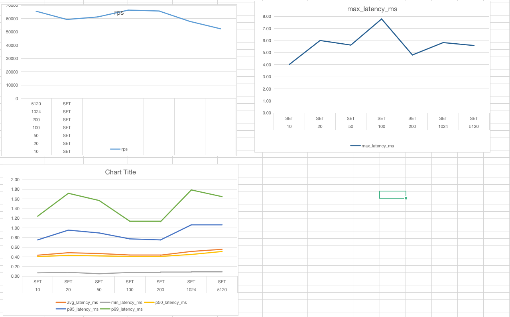
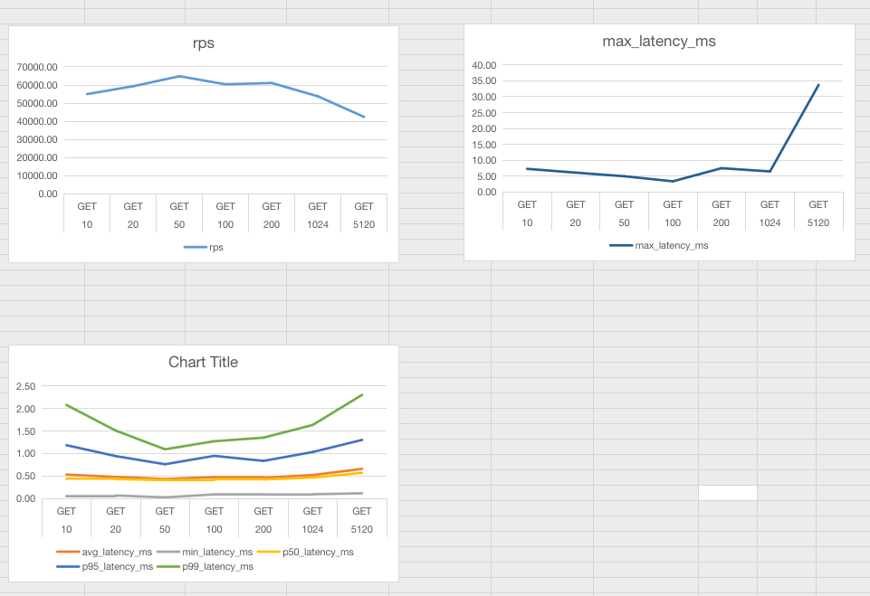

1、使用 redis benchmark 工具, 测试 10 20 50 100 200 1k 5k 字节 value 大小，redis get set 性能。
2、写入一定量的 kv 数据, 根据数据大小 1w-50w 自己评估, 结合写入前后的 info memory 信息  , 分析上述不同 value 大小下，平均每个 key 的占用内存空间。

# 测试 1

## set 性能测试
使用 [测试脚本](./sh.sh) 测试,统计 3 次的平均值绘制趋势图.

从上图可以看出,随着 size 从 10 byte 增到 100 byte,set 延迟逐渐降低,超过100 byte 后,延迟又逐渐升高
rps吞吐率随着 size 的增大而下降

## get 性能测试

从上图可以看出,随着 size 从 10 byte 增到 100 byte,get 延迟逐渐降低,超过 100 byte后,延迟又逐渐升高
rps吞吐率随着 size 的增大而下降.
max_latency_ms 最大延迟在 value size为 5120 byte时,急剧升高.

# 测试 2
写入 50w 的key,初始 memory  853.51K.

| size | used(MB) | used(B)     | avg(B)      | avg/size    |
|------|----------|-------------|-------------|-------------|
| 10   | 35.29    | 36130252.8  | 72.2605056  | 7.22605056  |
| 20   | 39.17    | 40198727.68 | 80.39745536 | 4.019872768 |
| 50   | 54.43    | 56199997.44 | 112.3999949 | 2.247999898 |
| 100  | 81.13    | 84196976.64 | 168.3939533 | 1.683939533 |
| 200  | 134.53   | 140190935   | 280.3818701 | 1.40190935  |
| 1024 | 638.07   | 668190894.1 | 1336.381788 | 1.30506034  |
| 5120 | 2959.36  | 3102239877  | 6204.479754 | 1.211812452 |

随着 size 的增大, avg/size 的比例逐渐减小,内存利用率越高.

在写入过程中,size 越大,写入的速度越慢.小的 size 可以使用 pipeline 加速写入.
